# 📱 WhatsAppBot — Automated Message Scheduler

<p align="center">
  <a href="https://flutter.dev/">
    
  </a>
  <a href="https://fastapi.tiangolo.com/">
    
  </a>
  <a href="https://www.python.org/">
    
  </a>
  <a href="https://www.sqlite.org/">
    
  </a>
</p>

> **WhatsAppBot**, kişisel ve kurumsal iletişim süreçlerinizi otomatize eden, ileri zamanlı mesaj planlama ve yönetim uygulamasıdır. Flutter tabanlı modern arayüzü ve güçlü Python backend altyapısı ile mesajlarınızın tam zamanında iletilmesini sağlar.

## 📋 Proje Hakkında

**WhatsAppBot**; kullanıcıların WhatsApp üzerinden göndermek istedikleri mesajları ileri bir tarihe planlamalarına olanak tanır.

- **Frontend**: Flutter (Windows, macOS, Linux)
- **Backend**: FastAPI + Python (Local Service)
- **Veritabanı**: SQLite (SQLAlchemy)
- **API**: WhatsApp Cloud API (Meta)
- **Özellikler**: 
  - İleri tarihli mesaj zamanlama
  - Detaylı gönderim geçmişi ve durum takibi
  - Rehber yönetimi
  - Özelleştirilebilir temalar ve kullanıcı profili

## 🖼️ Ekran Görüntüleri

### 1. Giriş ve Kayıt
Kullanıcı dostu ve güvenli giriş ekranları ile uygulamaya hızlı erişim.

<p align="center">
  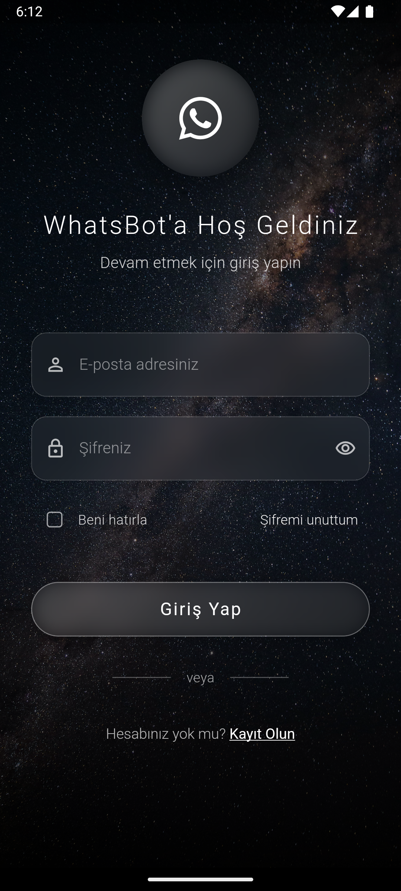
  
  <br/>
  <em>Giriş ve Kayıt Ekranları</em>
</p>

### 2. Ana Sayfa ve Dashboard
Planlanan mesajlarınızı, yaklaşan gönderimleri ve genel durumu tek bakışta görün.

<p align="center">
  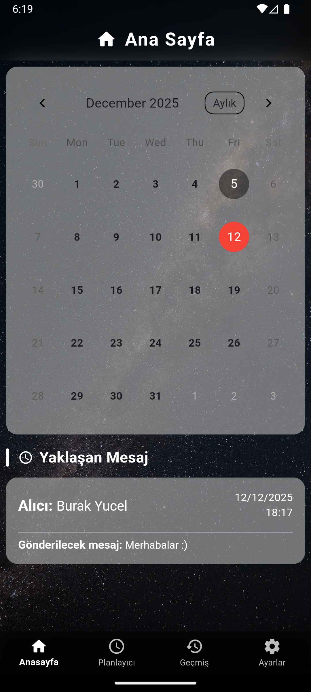
  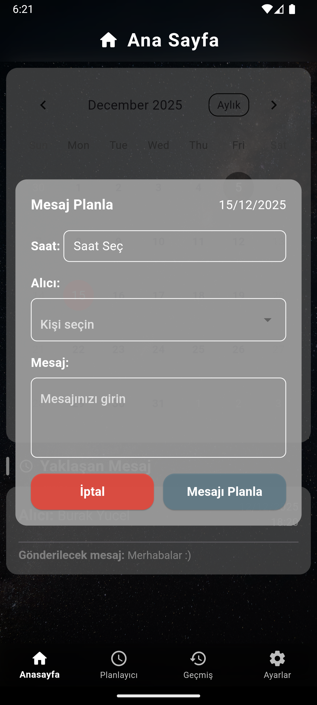
  <br/>
  <em>Ana Sayfa Görünümleri</em>
</p>

### 3. Mesaj Planlayıcı
Mesajınızı yazın, alıcıyı seçin, tarih ve saati belirleyin. Gerisini WhatsAppBot'a bırakın.

<p align="center">
  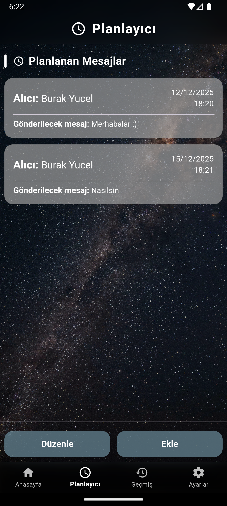<br/>
  <em>Mesaj Planlama Arayüzü</em>
</p>

### 4. Geçmiş ve Durum Takibi
Gönderilen, bekleyen veya hatalı mesajlarınızı detaylı bir şekilde inceleyin.

<p align="center">
  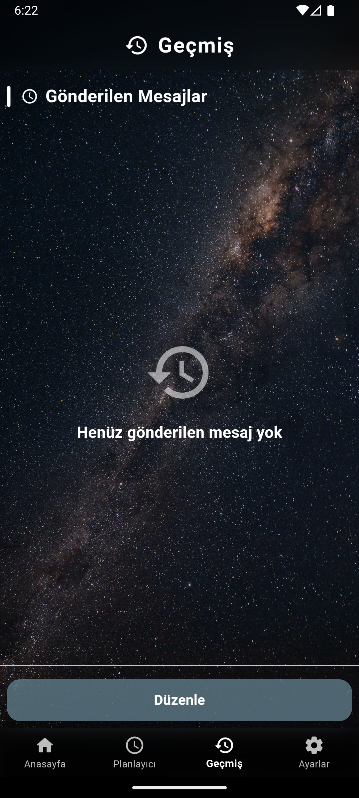<br/>
  <em>Mesaj Geçmişi Ekranı</em>
</p>

### 5. Rehber ve Kişiler
Sık iletişim kurduğunuz kişileri kaydedin ve hızlıca mesaj planlayın.

<p align="center">
  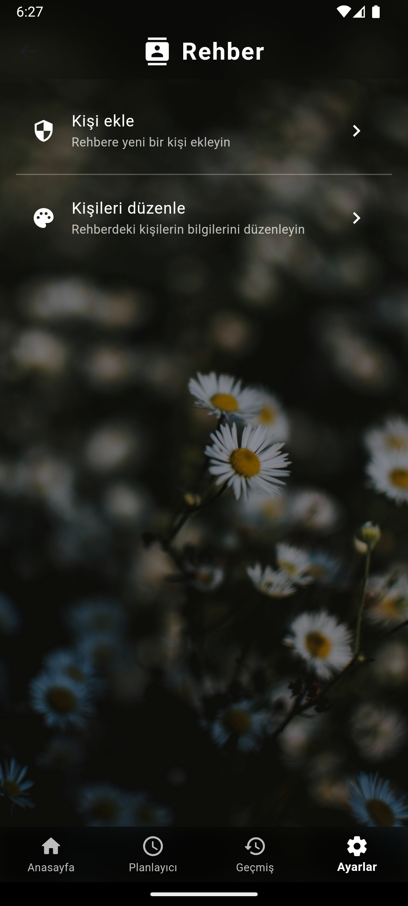<br/>
  <em>Rehber Yönetimi</em>
</p>

### 6. Ayarlar ve Kişiselleştirme
Uygulama temasını, profil bilgilerinizi ve cihaz izinlerini yönetin.

<p align="center">
  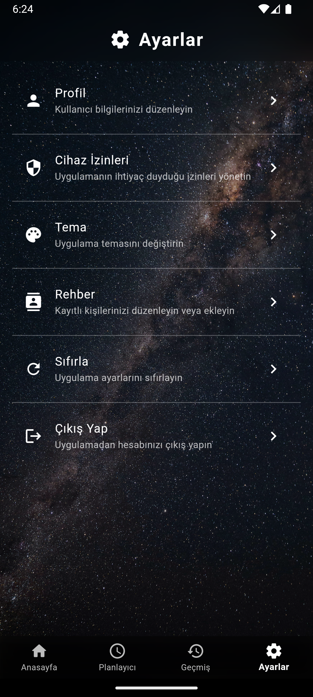
  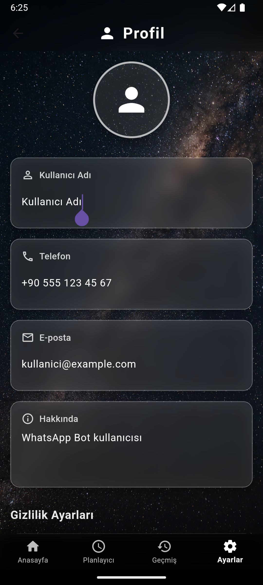
  
  <br/>
  <em>Ayarlar, Profil ve İzinler</em>
</p>

### 7. Temalar
Göz zevkinize uygun farklı tema seçenekleri.

<p align="center">
  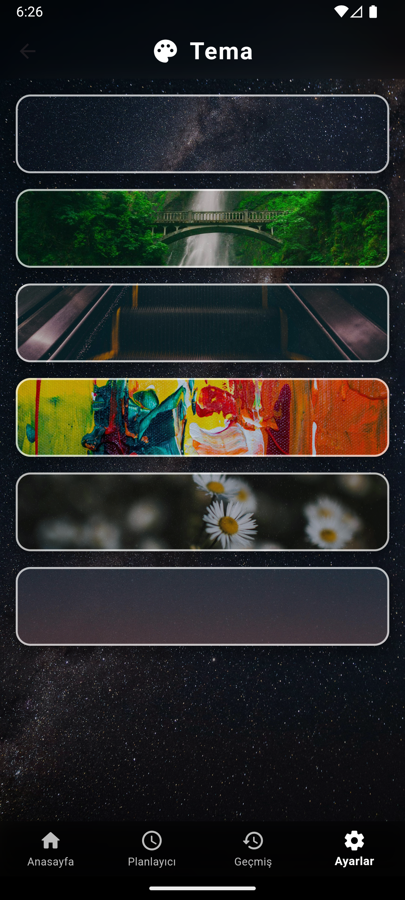
  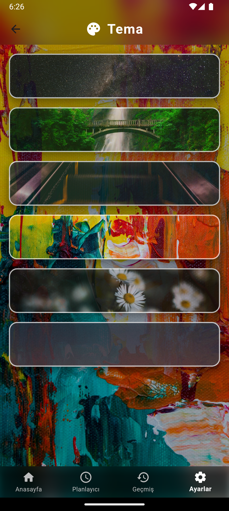
  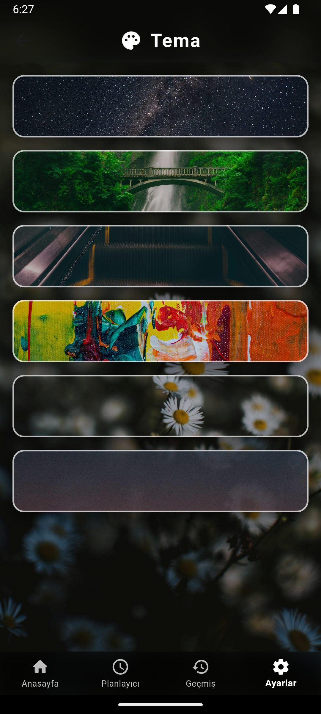
  <br/>
  <em>Tema Seçenekleri</em>
</p>

## 🛠️ Kullanılan Teknolojiler

### Frontend (Flutter)

| Teknoloji | Açıklama |
|-----------|----------|
| **Flutter** | Cross-platform UI Framework |
| **Provider** | State Management |
| **GoRouter** | Navigasyon ve Rotalama |
| **HTTP** | Backend ile iletişim |
| **Process** | Python servisini yönetme |

### Backend (Python)

| Teknoloji | Açıklama |
|-----------|----------|
| **FastAPI** | Modern, hızlı web framework |
| **APScheduler** | Gelişmiş zamanlama kütüphanesi |
| **SQLAlchemy** | ORM ve Veritabanı yönetimi |
| **Requests** | WhatsApp API istekleri |
| **Pydantic** | Veri doğrulama |

## 🚀 Kurulum ve Çalıştırma

Projeyi yerel ortamınızda çalıştırmak için aşağıdaki adımları izleyin.

### Gereksinimler
- Flutter SDK
- Python 3.8+
- WhatsApp Cloud API Hesabı (Meta Developers)

### 1. Repoyu Klonlayın
```bash
git clone https://github.com/BurakYucelPY/WhatsAppBot.git
cd WhatsAppBot
```

### 2. Python Ortamını Hazırlayın
Backend bağımlılıklarını yükleyin:
```bash
cd whatsapp_api_service
pip install -r requirements.txt
```

`.env` dosyasını oluşturun ve API bilgilerinizi girin:
```env
ACCESS_TOKEN=your_whatsapp_access_token
PHONE_NUMBER_ID=your_phone_number_id
API_KEY=your_super_secret_api_key
DATABASE_URL=sqlite:///./whatsapp_schedules.db
```

### 3. Uygulamayı Başlatın
Ana dizine dönün ve Flutter uygulamasını çalıştırın:
```bash
flutter run
```
*Not: Uygulama başlatıldığında Python servisi otomatik olarak arka planda çalıştırılacaktır.*

## 📁 Proje Yapısı

```
WhatsAppBot/
├─ lib/                         # Flutter Frontend Kodları
│  ├─ main.dart                 # Giriş Noktası
│  ├─ screens/                  # UI Sayfaları (Anasayfa, Planlayıcı vb.)
│  ├─ providers/                # State Management
│  ├─ services/                 # API ve Servisler
│  └─ models/                   # Veri Modelleri
├─ whatsapp_api_service/        # Python Backend Kodları
│  ├─ main.py                   # FastAPI Uygulaması
│  ├─ scheduler_service.py      # Zamanlama Mantığı
│  ├─ whatsapp_client.py        # WhatsApp API İstemcisi
│  ├─ database.py               # Veritabanı İşlemleri
│  └─ requirements.txt          # Python Kütüphaneleri
├─ assets/                      # Görseller ve Kaynaklar
└─ pubspec.yaml                 # Flutter Bağımlılıkları
```

## 💡 Nasıl Çalışır?

1.  **Planlama:** Kullanıcı Flutter arayüzünden bir mesaj planlar.
2.  **Kayıt:** Bu istek yerel Python servisine iletilir ve SQLite veritabanına kaydedilir.
3.  **Zamanlama:** `APScheduler`, planlanan zaman geldiğinde tetiklenir.
4.  **Gönderim:** `WhatsAppCloudClient`, Meta API'sini kullanarak mesajı alıcıya iletir.
5.  **Geri Bildirim:** Mesajın durumu (gönderildi/hata) veritabanında güncellenir ve arayüze yansıtılır.

## 🎯 Gelecek Hedefleri

- [ ] Medya (Resim/Video) gönderim desteği.
- [ ] Toplu mesaj gönderimi (Broadcast).
- [ ] Gelen mesajları yanıtlama (Chatbot entegrasyonu).
- [ ] Bulut senkronizasyonu (Firebase/AWS).

---
<p align="center">
  Made with ❤️ by <a href="https://github.com/BurakYucelPY">Burak Yücel</a>
</p>